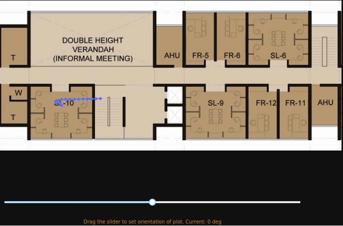

### BlueTrack

Present Target: Dynamic realtime plotting of sensor data from OBLU device to a web based GUI using plotly/dash 

Binder: https://mybinder.org/v2/gh/rahulrajpl/bluetrack/master

Stage 1: (2D live plotting) 

Stage 2: (3D live plotting) 

Stage 3: 2D live plotting with pan, zoom and rotate functions

Stage 4: Analytics on Trajectory data (In progress)

#### References

    [1] https://community.plot.ly
    [2] https://pythonprogramming.net/live-graphs-data-visualization-application-dash-python-tutorial/ (via @Sentdex )
    [3] https://www.youtube.com/watch?v=Ercd-Ip5PfQ (Matplotlib code)