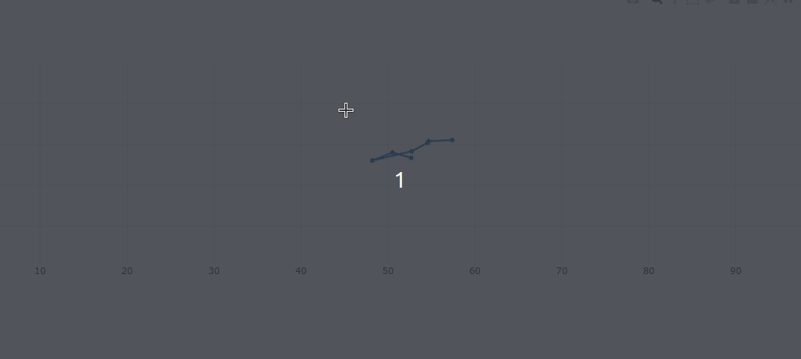

### ObluTrack

Present Target: Dynamic realtime plotting of sensor data from OBLU device to a web based GUI using plotly/dash 

Stage 1: (2D live plotting)

Stage 2: (3D live plotting)

#### References

    [1] https://community.plot.ly
    [2] https://pythonprogramming.net/live-graphs-data-visualization-application-dash-python-tutorial/ (via @Sentdex )
    [3] https://www.youtube.com/watch?v=Ercd-Ip5PfQ (Matplotlib code)